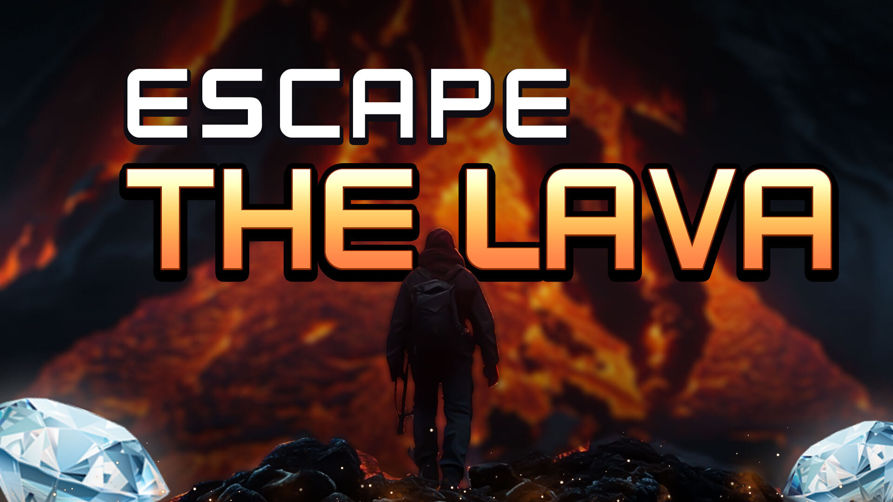

# 🎮 Nexus Games Ultimate Platform



Nexus Games is a state-of-the-art, high-performance mini-game platform designed to deliver a seamless, arcade-style experience directly in the browser. Built with a focus on **Visual Excellence**, **Mechanical Precision**, and **Robust Backend Architecture**, this project serves as a comprehensive demonstration of full-stack web development.

---

## 🚀 Live Deployments

> [!TIP]
> Use the links below to access the platform globally.

| Component | Tech | Live URL |
| :--- | :--- | :--- |
| **Frontend** | 🌐 Vanilla JS / CSS3 | [https://college-assignment-chi.vercel.app/](https://college-assignment-chi.vercel.app/) |
| **Backend** | 🐍 FastAPI / SQLite | [https://collegeassignment-11l3.onrender.com](https://collegeassignment-11l3.onrender.com) |

---

## ✨ Core Interactive Modules

The platform features four uniquely engineered mini-games, each testing different cognitive and mechanical skills:

### 1. 🔥 Escape the Lava
Navigate a grid-based environment while the floor is literally turning into lava.
- **Goal**: Reach the final row before the lava consumes you.
- **Mechanics**: Move tile-by-tile. Fire tiles reduce lives, while green tiles are safe zones.
- **Challenge**: The lava advances row-by-row at an increasing pace.

### 2. 🎯 Sharp Shooter
A high-intensity accuracy challenge designed to test your reflex speed.
- **Goal**: Neutralize 15 targets as they spawn at randomized grid locations.
- **Mechanics**: Click targets immediately upon appearance.
- **Difficulty Scaling**: The "Spawn Rate" decreases by **80ms per successful hit**, making the later stages of the game exponentially difficult.

### 3. 🛑 Red Light Green Light
A classic survival challenge where patience is your greatest asset.
- **Goal**: Reach the finish line (`🏁`) without moving during a "Red Light."
- **Visual Cues**: A real-time **Status HUD** and screen-wide neon pulses indicate current light status.
- **Penalty**: Any click during a Red Light results in an immediate loss of life.

### 4. 🎨 Find the Color
A swift color-recognition module for rapid decision making.
- **Goal**: Identify and click the specific target color displayed in the HUD.
- **Mechanics**: The grid is randomized with various shades; only the precise match is valid.

---

## 🛠️ Technical Architecture

### **Frontend Excellence**
- **UI Design**: Modern "Glassmorphism" aesthetic with vibrant neon highlights.
- **Animations**: CSS3-powered transitions and 3D parallax effects for the game selection carousel.
- **Responsiveness**: Fully responsive grid algorithms that adapt to any screen size.

### **Robust Backend**
- **Framework**: **FastAPI** for asynchronous, high-speed request handling.
- **Security**: JWT (JSON Web Token) token-based authentication with **bcrypt** password hashing.
- **Persistence**: **SQLite** local database used for permanent storage of user credentials and historical game progress.

---

## 📂 Project Structure

```text
├── index.html            # Core Frontend Application (Vanilla JS/CSS/HTML)
├── main.py               # FastAPI Backend Service
├── nexus.db              # SQLite Database (Production Instance)
├── requirements.txt      # Python Backend Dependencies
├── .gitignore            # Deployment exclusion rules
└── assets/               # High-fidelity media (MP4/JPG/PNG)
```

---

## ⚙️ Development Guide

### Prerequisites
- Python 3.8+
- Modern Web Browser (Chrome, Firefox, Safari)

### Installation
1. **Clone & Setup**:
   ```bash
   git clone https://github.com/sankalp250/CollegeAssignment.git
   cd CollegeAssignment
   ```
2. **Backend Startup**:
   ```bash
   pip install -r requirements.txt
   python main.py
   ```
3. **Frontend Connection**:
   Ensure line 936 in `index.html` is set to `http://localhost:8000` for local development.

---

## 🗺️ Roadmap
- [ ] **Leaderboard System**: Global player rankings based on high scores.
- [ ] **Multiplayer Mode**: 1v1 challenges for "Red Light Green Light."
- [ ] **Custom Skins**: Unlockable grid themes and emoji packs.

---

## 📜 Credits
**Developer**: Sankalp Singh
**Purpose**: College Assignment - Advanced Full-Stack Development Demo
